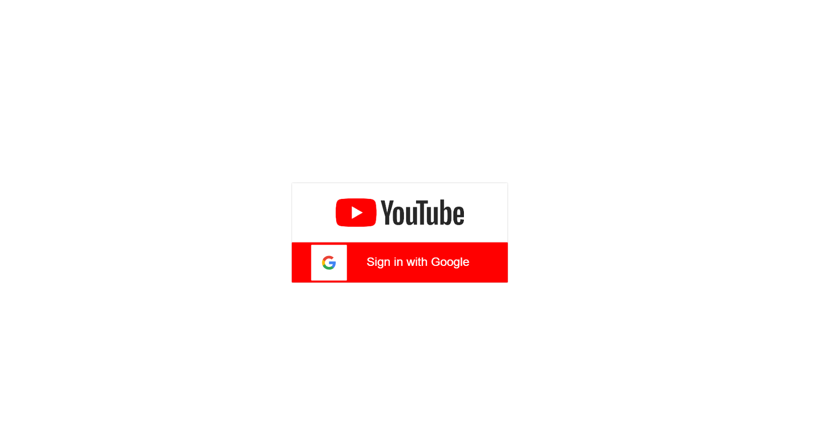

# YOUTUBE-CLONE


<p>This is a Project built using Reactjs and firebase auththentication </p>
<a href="https://clone-34b8d.firebaseapp.com/">View Demo</a>


## Technologies Used

- [React](https://react.dev/learn)
- [Firebase](https://firebase.google.com/docs/web/setup) 
- [NPM](https://www.npmjs.com/)

## Getting Started

To get started with project just simply fork this repo or download the zip file locally to your machine.

To get a local copy up and running follow these simple example steps.

### Prerequisites

Start with the latest version of NPM to avoid any errors:

- npm
  ```sh
  npm install npm@latest -g
  ```
- Also install additional dependencies
``` 
  npm install firebase

 ```

You can follow this doc on how to initialize the [Firebase/app](https://firebase.google.com/docs/web/setup)

### Installation

1. Clone the repo
   ```sh
   git clone https://github.com/emerald1996/youtube-clone
   ```
2. Install NPM packages
   ```sh
   npm install
   ```
3. Start the server
   ```sh
   npm start
   ```

## Contribution
Contributions are welcome! If you'd like to contribute to this project, please follow these steps:
1. Fork the repository.
2. Create a new branch (`git checkout -b feature/new-feature`).
3. Make your changes and commit them (`git commit -m 'Add new feature'`).
4. Push to the branch (`git push origin feature/new-feature`).
5. Create a new Pull Request.

